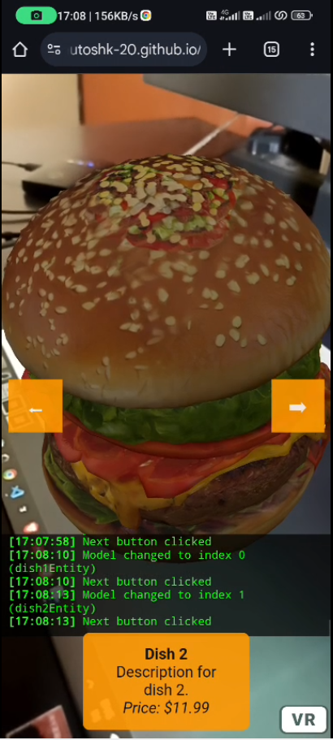

- author:
    - name: Ashutosh Khedkar
    - link: https://ashutoshk-20.github.io/

- title: AR Menu
    - description: "An augmented reality web application that enhances the dining experience by displaying interactive 3D models of menu items."
    - repository: https://github.com/ashutoshk-20/ar-menu
    - link: https://ashutoshk-20.github.io/ar-menu/

- image:
    - source: "@images/ar-menu-preview.png"

    - alt: "Screenshot of AR Menu interface displaying 3D food models"
  

- vedio:
    - source: "@images/ar-menu-implementation.mp4"
    - alt: "Vedio implementation of AR Menu interface displaying 3D food models"
<video width="640" controls>
  <source src="./images/ar-menu-implementation.mp4" type="video/mp4">
</video>

## About AR Menu

AR Menu is an innovative web-based application that leverages augmented reality (AR) to transform the traditional dining experience. By integrating interactive 3D models of food items, it allows users to visualize dishes in a more engaging and informative manner before placing an order. This approach aims to bridge the gap between expectation and reality, reducing instances of order dissatisfaction.

The application is built using *HTML*, *JavaScript*, and *WebXR technologies*, ensuring compatibility across modern browsers and devices that support AR functionalities. Users can access the AR Menu directly through their browsers without the need for additional installations, making it a convenient solution for restaurants aiming to modernize their menu presentation.

--- 

## Tech Stack
- *Frontend*: HTML, JavaScript
- *AR Integration*: WebXR API
- *3D Modeling*: GLTF/GLB models for realistic food representations
---

## Credits
- *Three.js*: For rendering 3D models within the browser.

- *WebXR API*: Enabling augmented reality experiences on the web.

- *GitHub Pages*: Hosting the web application for easy access.
---

## Author
Developed by Ashutosh Khedkar(https://ashutoshk-20.github.io/) & Parth Lhase(https://github.com/LhaseParth2610), a passionate developer with interests in web technologies and immersive experiences.
Explore more projects on GitHub(https://github.com/ashutoshk-20) or connect via LinkedIn(https://www.linkedin.com/in/ashutosh-khedkar-a47b2825a/).
